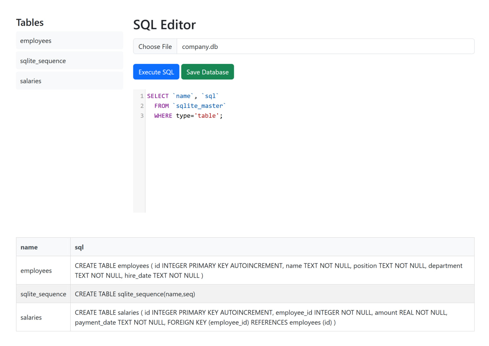

# SQLite Browser

SQLite Browser is a web-based SQLite database browser that allows you to load, execute SQL queries, and view results directly in your browser. It is designed to work with SQLite `.db` files, enabling users to interact with their SQLite databases via a user-friendly interface.

## Features

- Load SQLite `.db` files
- Execute SQL queries and view results in table format
- Browse tables in the database
- Save modified databases
- SQL editor with syntax highlighting
- Supports exporting the database to a file



## Installation

1. Clone the repository:
   ```bash
   git clone https://github.com/BaseMax/sqlite-browser.git
   cd sqlite-browser
   ```

2. Install dependencies:
  ```bash
  npm install
  ```

3. Start the server:
  ```bash
  node serve.js
  ```

4. Open the browser and navigate to `http://localhost:4848/`.

## Usage

- Load a database: Use the file input at the top to load an SQLite .db file.
- Execute SQL: Write your SQL query in the editor and click "Execute SQL".
- Save the database: After making changes, click "Save Database" to download the modified .db file.
- Browse tables: Click on any table name in the list to populate the editor with a SELECT query for that table.

## File Structure

```
.
├── client
│   ├── assets
│   │   ├── css
│   │   │   ├── bootstrap.min.css
│   │   │   ├── codemirror.min.css
│   │   │   └── custom.css
│   │   └── js
│   │       ├── bootstrap.min.js
│   │       ├── codemirror.min.js
│   │       ├── popper.min.js
│   │       ├── script.js
│   │       ├── sql-wasm.wasm
│   │       ├── sql.min.js
│   │       └── worker.sql-wasm.js
│   └── sqlite_browser_ui.html
├── LICENSE
├── README.md
├── serve.js
└── .git
```

### License

This project is licensed under the MIT License - see the LICENSE file for details.

Copyright © 2025 Max Base
